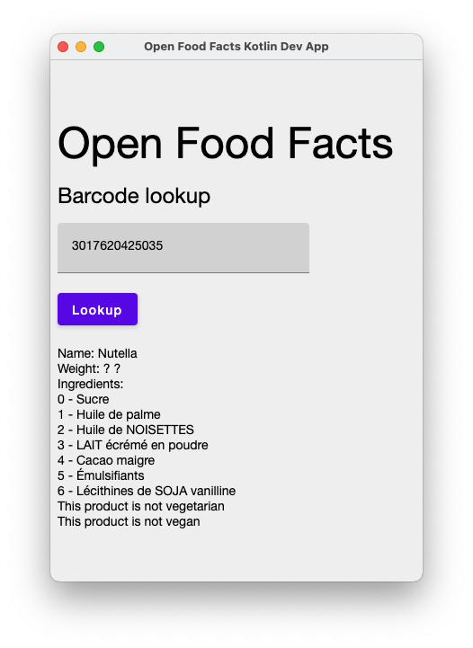
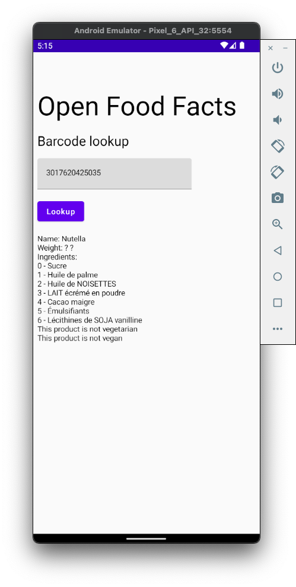
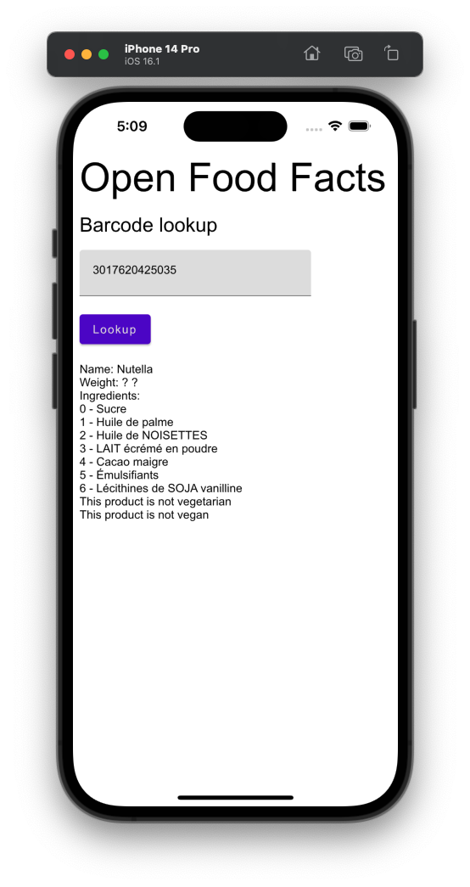

# Dev App Project

## ⚡Quick-start

- Just looking to run the Application? See [Running the Dev App](#running-the-dev-app).

## Purpose

The Multiplatform Dev Application has two major purposes:
1. **Provides example usage** for developers wanting to use the [OpenFoodFacts Kotlin Library](../openfoodfacts-kotlin/README.md) in their own [Kotlin Multiplatform](https://kotlinlang.org/docs/multiplatform.html) application.
2. Provides a dedicated 'playground' for developers who are further developing and maintaining the Library project.

## Features

Reflecting the current state of the **Library**, the **Dev App** is also currently **very** basic:
- User enters a barcode using the soft/hardware keyboard (according to platform)
- User taps the 'Lookup' button
- After processing, an outcome is displayed. Either:
	- Basic product information -or-
	- a 'No product found' message

Of course, this initial implementation is only a proof-of-technology and foundation for further work.  The author plans to work towards v2 search and other Open Food Facts API features.

## Supported Platforms

For simplicity, this documentation refers to 'Dev App' in the singular. However the 'Dev App' **may actually be counted as three or more Applications** by virtue of its implementation across multiple platforms.

Currently, three platforms are implemented:
|#|Platform|Repository folder|Install/Run action|
|-|--------|------------------|-----------|
|1|[Android](https://kotlinlang.org/docs/android-overview.html)|`/openfoodfacts-kotlin-dev-app`|Gradle task `:android:installDebug`|
|2|[Desktop](https://kotlinlang.org/docs/jvm-get-started.html)|`/openfoodfacts-kotlin-dev-app`|Gradle task `:desktop:run`|
|3|[iOS](https://kotlinlang.org/docs/multiplatform.html#android-and-ios-applications)|`/openfoodfacts-kotlin-dev-app/ios`|Xcode 'Run' action in `OpenFoodFactsKotlin.xcodeproj`|

...[Web](https://kotlinlang.org/docs/js-overview.html) and other [native](https://kotlinlang.org/docs/native-overview.html) targets are possible future additions, being relatively inexpensive thanks to the underlying support of [Kotlin Multiplatform](https://kotlinlang.org/docs/multiplatform.html).

## Running the Dev App

### Prerequisites

> ⚠️ **Currently, macOS is assumed**  
> Due to including an iOS target, these instructions currently cater for working on a macOS development machine.  If contributors wish to improve the configuration/documentation to enable development on other Operating Systems this are welcomed 👍

#### Software

You are expected to have installed:

- **macOS**
- [**Xcode**](https://developer.apple.com/xcode/) (tested with 14.1)
- [**IntelliJ**](https://www.jetbrains.com/idea/) / [**Android Studio**](https://developer.android.com/studio) IDE's (recommended via [Jetbrain's Toolbox](https://www.jetbrains.com/toolbox-app/))
- **Android SDK** (may [installed/updated as part of Android Studio](https://developer.android.com/studio/intro/update))

#### Project Steps

After checking out this repository locally...

1. A [`local.properties` file](https://developer.android.com/studio/build#properties-files) must be created at `build-system/local.properties`

   - **This need only be done once**, after checking out the repo
   - This only property required within the file is `sdk.dir`; your **Android SDK location**
   - Copy and edit the example file at:  
     `build-system/local.properties.example`
   - The **Library** and **Dev App** projects both [symlink](https://en.wikipedia.org/wiki/Symbolic_link) their `local.properties` files to:  
     `build-system/local.properties`,  
     ...this avoids needing to maintain multiple copies 👌.

2. Next you must build & publish the **Library** to the project-local [Maven Repository](../repository/maven/ci/README.md).

   ```bash
   cd openfoodfacts-kotlin
   ./gradlew publishAllPublicationsToCiRepository
   ```

Now you can build & run the **Dev App** on any supported platform  ✅ See below:

### Build & run for each supported Platform

#### Desktop

> ⚠️ You must have completed the two [prerequisite](#prerequisites) steps above before doing this

Running the **Desktop** target is the quickest & easiest.  It is recommended to run the Desktop App at least once to verify your setup, even if your intended focus is a Mobile target.

```bash
cd .. # Return to repository root following prerequisite step (2), if necessary
cd openfoodfacts-kotlin-dev-app
./gradlew :desktop:run
```

The **Desktop Dev App** will now build (against the **Library** published to the [Maven Repository](../repository/maven/ci/README.md) in step 2) and will start.  Tap the 'Lookup' button to initiate a Product Search against the default populated barcode for *Nutella*.  A successful response looks something like this:


You can also use [IntelliJ IDEA](https://www.jetbrains.com/idea/) or [Android Studio](https://developer.android.com/studio) to open the Gradle project at:  
`openfoodfacts-kotlin-dev-app` 
...to run or further develop the Desktop Dev App.

#### Android

> ⚠️ You must have completed the two [prerequisite](#prerequisites) steps above before doing this

- Use [Android Studio](https://developer.android.com/studio) or [IntelliJ IDEA](https://www.jetbrains.com/idea/) to open the Gradle project at this repository path:
  `/openfoodfacts-kotlin-dev-app`
- You can install the Android App on a Connected Device or Emulator by executing the Gradle task:
  `:android:installDebug`
- Then, run the installed Application using the launcher menu on your Device/Emulator.



#### iOS

> ⚠️ You must have completed the two [prerequisite](#prerequisites) steps above before doing this

- Use Xcode to open the Xcode Project at this repository path:
  `/openfoodfacts-kotlin-dev-app/ios`
- Ensure an iOS simulator is selected as the run target in the IDE.
- Press Xcode's 'Start' button.
- The App will build & run on Xcodes default Simulator:



> ⚠️ **Running on a real iOS Device**  
>
> To run on a real iOS Device, you will need to modify the Dev App Xcode project with suitable provisioning comprised of e.g:
>
> - Team ID
> - Code-signing Identity
> - Certificate 
> - Profile
>
> ...this configuration is common in iOS Development and is outside of the scope of this documentation.
